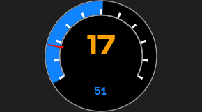
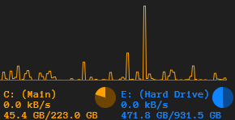
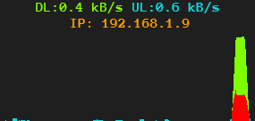
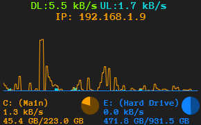
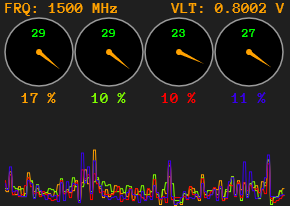
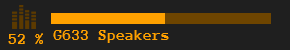

InCH
====
*A system monitor skin suite for Rainmeter.*

## Functionality
### System Resource Monitoring
A main system resource gauge is provided to track CPU and RAM usage. CPU usage is computed as percentage 
of total clock time utilized by all processes other than the idle process, across all cores. RAM usage is computed as utilized physical memory.

Disk net read-write throughput can be displayed instantaneously as well as over time in graphical format. 
Disk capacity is also shown. Up to two disks supported.

Network instantaneous up and down throughput, throughput over time as a graph, LAN IP, and WAN IP can be displayed. 
Cursor over LAN IP to reveal WAN IP.

A skin that combines the network and drive monitors is also provided.

A per-core CPU utilization and temperature monitor is provided, with histogram for tracking utilization over time. 
Also displays CPU clock frequency and voltage. Requires CoreTemp.

### Timekeeping
A standard digital clock + date display are available, with customizable locale and format.

A system uptime clock and day-of-year/week-of-year counter are also available.

### Audio Control
A system audio output control is available, with clickable volume control and muting.

A 10-band frequency visualizer with stereo + input level monitor is available.

A 10-band frequency visualizer with 7.1 input level monitor is also provided.

A media player controller is provided. This requires an active WebNowPlaying connection (through Spicetify or WNP's browser plugin). 
Volume control and shuffle/repeat buttons are clickable. Designed to work best with Spotify.

## Installation & Optional Dependencies
1. Download and install the latest version of Rainmeter (instructions here), if you have not already done so.
2. Download the latest .rmskin release from GitHub.
3. Run through .rmskin file and follow Rainmeter's installation prompts.
4. Install any optional dependencies desired:
* [WebNowPlaying](https://github.com/tjhrulz/WebNowPlaying) - required for media player skin
* [Spicetify](https://github.com/khanhas/Spicetify) - required for WebNowPlaying to work with a Spotify desktop client
* [CoreTemp](https://www.alcpu.com/CoreTemp/) - required for CPU temperature and per-core utilization monitors

## Setup & Customization
After installation, a default configuration should be loaded and display the suite. As with any Rainmeter skin, components can be disabled or moved at will.

To set up some skins, navigate to the skin installation location (likely Documents/Rainmeter/Skins/InCH). 
Navigate to @Resources/Styles. Open [GlobalVariables.inc](../@Resources/Styles/GlobalVariables.inc) and edit any values that need to be tailored to your system, 
e.g. drive letters, your network upstream and downstream speeds, and the gain to apply to the visualizer levels. If you have issues 
with the network skin, WiFiAdapterID and NetInterface may need to also be modified.

The suite can be further customized by editing the style files in @Resources/Styles. Either copy the Default style to a new style and 
change the style path in GlobalVariables, or edit the Default style directly. Change the variables in [StyleSheetVars.inc](../@Resources/Styles/Default/StyleSheetVars.inc) 
to modify colors, fonts, date formats, etc. Options are grouped per skin. Change the style definitions in [MeterStyles.inc](../@Resources/Styles/Default/MeterStyles.inc) to affect any skin using those styles.